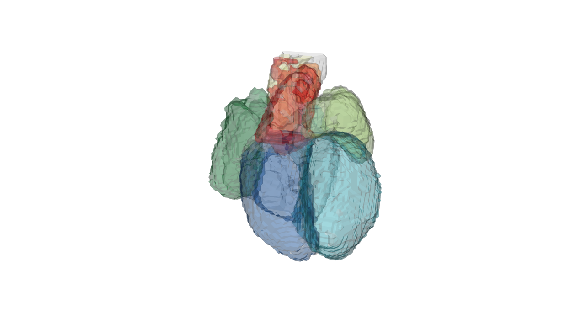
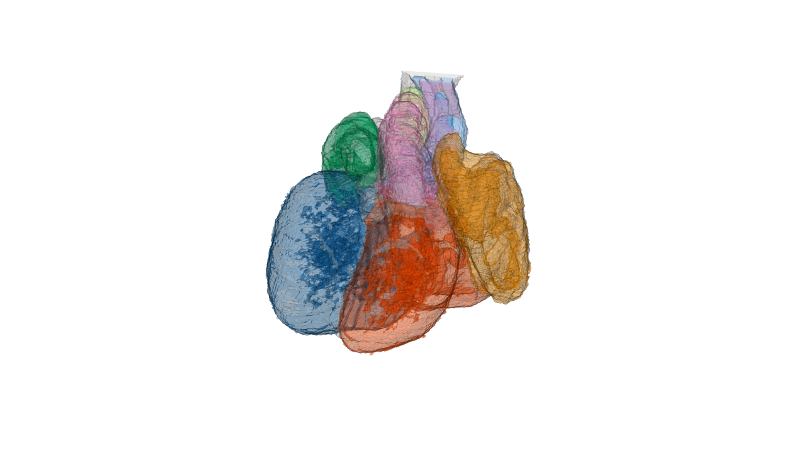
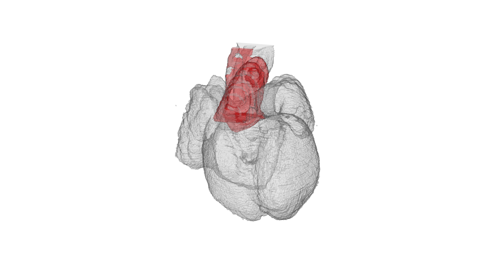
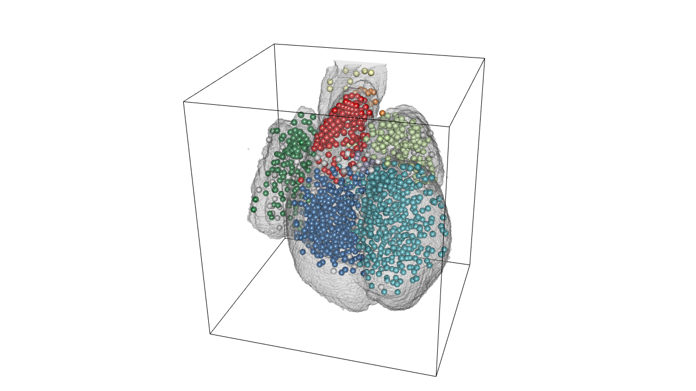
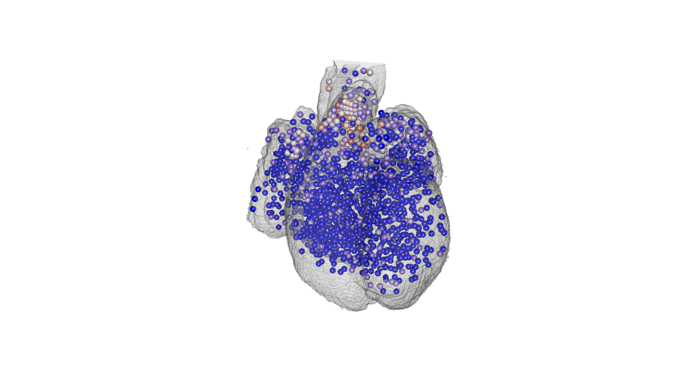

```{r setup, include=FALSE}
knitr::opts_chunk$set(echo = TRUE)
```

## Description of the data

Begin by loading the pre-processed data:

```{r}
load('./data/ST_heart_27032018.RData')
```

Lets see what it contains:

```{r}
names(heart)
```

There are two data frames one with the RNAseq data and one with the atlas data. 
Every row is  a spot and the two data frames are matched so `heart$atlas[123,]` is the same spot as `heart$genes[123,]`.
```{r}
head(heart$atlas)
heart$genes[1:10,1:4]
```

So lets explain the variables in `heart$atlas`:
```{r}
names(heart$atlas)
```
| Variable | Explanation      |
| :---         |     :---      | 
| `x`   | X centroid of spot in  original pixel image  | 
| `y`     | Y centroid of spot in  original pixel image |
| `intensity`  | not really used here. |
| `area`  | area in pixels of spot. |
| `id`  | unique integer value for the region the spot is in. |
| `color`  | hex color code for the region the spot is in. |
| `color2`  | Color code corrected for spots that couldn't be assigned |             
| `acronym`  | region acronym for where the spot is in. |
| `name`  | region name for where the spot is in. |
| `right.left`  | X coordinate in pixels of the reference atlas |
| `rostral.caudal`  | Y coordinate in pixels of the reference atlas. |
| `anterior.posterior`  | Z oordinate in pixels of the reference atlas |             
| `spot.id`  | just `1:now(heart$atlas)` |
| `nuclei`  | number of nuclei in spot |             
| `image`  | The image the spots came from |             
| `spot.pos`  | The array position of the spot in 33x35 |             

## 3D heart plot using RGL

RGL is a package that uses OpPenGL as backend for 3D visualization in R.
misc3d is a package that we will use for drawing scenes in 3d.

```{r message=FALSE, results='hide',fig.keep='all', warning=FALSE}
library(rgl)
library(misc3d)
```

Load the 3D volume heart atlas.
```{r}
load('./data/heart.RData')
```

We begin by defining the perspective we want to plot from (this doesn't have to make sense now I'll show later how to get these parameters):
```{r}
perspective<-list(FOV = 30, ignoreExtent = FALSE, listeners = 1L, 
    mouseMode = structure(c("trackball", "zoom", "fov", "pull"
    ), .Names = c("left", "right", "middle", "wheel")), skipRedraw = FALSE, 
    userMatrix = structure(c(-0.0108720660209656, 0.899227440357208, 
    0.437346190214157, 0, 0.955604612827301, -0.119448974728584, 
    0.269354522228241, 0, 0.2944515645504, 0.420858442783356, 
    -0.858007192611694, 0, 0, 0, 0, 1), .Dim = c(4L, 4L)), scale = c(1, 
    1, 1), viewport = structure(c(0L, 0L, 1280L, 720L), .Names = c("x", 
    "y", "width", "height")), zoom = 1, windowRect = c(0L, 45L, 
    1280L, 765L), family = "sans", font = 1L, cex = 1, useFreeType = TRUE)
```
Lets plot the entire heart and then regions outlines.

```{r message=FALSE, results='hide',fig.keep='all', warning=FALSE}
#open 3D plot window
open3d(windowRect = c(0, 0, 1280, 720))
#use the perspective
par3d(perspective)
#draw low-resolution heart with color coding
drawScene.rgl(organ.dwnsmp[which(names(organ.dwnsmp)%in%c('WH',  'RA', 'RV', 'LA', 'LV', 'P', 'A', 'OT'))])
rgl.snapshot(file='./images/lowresolution.png')
```

This is a low resolution of the heart that you can rotate and zoom in with the ouse in realtime. 

If you have rotated the heart and want to save the perspective parameters into a R object to use later simply run:

```{r}
pp<- par3d(no.readonly = TRUE)
```
And the parameters are now saved into `pp` and you can set the perspective in the 3D plot by `par3d(pp)` before plotting with `drawScene.rgl()`.

For more high resolution rendering you set the position you want of the heart and then rerun the code but not using the `organ.dwnsmp` but `organ` instead.

```{r message=FALSE, results='hide',fig.keep='all', warning=FALSE}
drawScene.rgl(organ[which(names(organ.dwnsmp)%in%c('WH',  'RA', 'RV', 'LA', 'LV', 'P', 'A', 'OT'))])
rgl.snapshot(file='./images/highresolution.png')
```


You can select which region to highlight by setting the acronyms in the character vector. here I show `WH` whole heart as well as `OT` outflow tract:

```{r message=FALSE, results='hide',fig.keep='all', warning=FALSE}
drawScene.rgl(organ[which(names(organ.dwnsmp)%in%c('WH','OT'))])
rgl.snapshot(file='./images/OT_highlight.png')
```


Lets plot all the spots with the color according to their anatomical region:


```{r message=FALSE, results='hide',fig.keep='all', warning=FALSE}
#draw all the spots with region color
drawScene.rgl(organ[which(names(organ.dwnsmp)%in%c('WH'))])
radius.of.spots.in.atlas.pixels<- (100/(2383.36/532))/3
spheres3d(598-heart$atlas$rostral.caudal, 532-heart$atlas$right.left, heart$atlas$anterior.posterior, col=heart$atlas$color2, radius=radius.of.spots.in.atlas.pixels)
#bounding box
box3d()
rgl.snapshot(filename='./images/3d_heart_spots.png')
```


Changeing colors depending on region can easily be done like this:
```{r}
#create a matching index with regions accoridng to the order you want to change color
matching.index <- match(heart$atlas$acronym, c('RA', 'LA', 'RV', 'LV', 'P', 'A', 'OT', 'epc'))
#overwrite with the color vector
heart$atlas$color2[!is.na(matching.index)] <- c('#c2e699', "#238443", '#41b6c4', '#225ea8', '#ffffb2', "#fd8d3c", '#e31a1c', '#9e9ac8')[na.omit(matching.index)]
```

Finally lets plot the gene expression of specific spots:
```{r message=FALSE, results='hide',fig.keep='all', warning=FALSE}
#plot gene of interest OGN
gene.of.interest<-heart$genes[,which(colnames(heart$genes)=='ENSG00000106809')]

#color ramp palette base don gene expression
PaletteFunction <- colorRampPalette(c("blue", "white", "red"), space = "Lab")
gene.expression<-PaletteFunction(100)[as.numeric(cut(scale(log2(gene.of.interest+1)), breaks = 100))]

drawScene.rgl(organ[which(names(organ.dwnsmp)%in%c('WH'))])

spheres3d(598-heart$atlas$rostral.caudal, 532-heart$atlas$right.left, heart$atlas$anterior.posterior, col=gene.expression, radius=radius.of.spots.in.atlas.pixels )
rgl.snapshot(filename='./images/OGN_3d_heart.png')
```


## tSNE example.

Lets get the data ready for Seurat package:
```{r, message=FALSE, results='hide',fig.keep='all', warning=FALSE}
#Set all genes not detected oin other sections (they are NA) to 0 count.
tmp<-heart$genes
tmp[which(is.na(tmp), arr.ind = TRUE)]<-0

#needs to be transposed for Seurat
tmp<-t(tmp)
#use indices instead of spot ID (e.g. 13x24).
colnames(tmp)<-seq_along(colnames(tmp))
```
Then load Seurat and make Seurat objects:
```{r, message=FALSE, results='hide',fig.keep='all', warning=FALSE}
library(Seurat)
#make Seurat object with min 1000 genes
seurat.object<-CreateSeuratObject(tmp,project="STheart", min.cells = 3, names.field = 2, min.genes = 1000)
```
Next we normalize the data and subset only differentially expressed genes with average expression cutoff of 0.5 to 5 and dispersion cutoff of >2.
```{r, message=FALSE, results='hide',fig.keep='all', warning=FALSE}
#normalize
seurat.object <- NormalizeData(object = seurat.object, normalization.method = "LogNormalize", scale.factor = 10000)
#do cut off for diff expressed genes
seurat.object <- FindVariableGenes(object = seurat.object, mean.function = ExpMean, dispersion.function = LogVMR, x.low.cutoff = 0.5, x.high.cutoff = 5, y.cutoff = 0.8)
#scale here (can also regress out things)
seurat.object <- ScaleData(object = seurat.object) #, vars.to.regress=names(images)
```
Compute PCA:
```{r, message=FALSE, results='hide',fig.keep='all', warning=FALSE}
#compute 100 PCAs
seurat.object <- RunPCA(object = seurat.object, pc.genes = seurat.object@var.genes, do.print = TRUE, pcs.compute = 100)
seurat.object <- JackStraw(object = seurat.object, num.replicate = 100, do.print = FALSE)
PCElbowPlot(object = seurat.object, num.pc=100)
```

Based on the info from the knee-plot we will use only the first 12 PCAs as input to tSNE:
```{r, message=FALSE, results='hide',fig.keep='all', warning=FALSE}
#the first 12 CA contains most info
seurat.object <- FindClusters(object = seurat.object, reduction.type = "pca", dims.use = 1:12, resolution = 1, print.output = TRUE, save.SNN = FALSE)
#run the TSNE
seurat.object <- RunTSNE(object = seurat.object, dims.use = 1:12, do.fast = TRUE, check_duplicates = FALSE)
```

This will plot the tSNE with anatomical color:

```{r}
#anatomical color with slight transparency 80%.
anatomical.color <- paste0(heart$atlas$color2[as.integer(colnames(seurat.object@scale.data))], '80')
#plot the tSNE
par(mfrow=c(1,2))
plot(seurat.object@dr$tsne@cell.embeddings, pch=16, cex=0.9, col=paste0(heart$atlas$color2[as.integer(colnames(seurat.object@scale.data))], '80'), asp=1, xlab='', ylab='', main='', axes=FALSE)

#plot legend is seperate plot
legend.data<-data.frame(col = unique(heart$atlas$color2), acronym = na.omit(unique(heart$atlas$acronym)), name = na.omit(unique(heart$atlas$name)) )
legend.data<-legend.data[order(legend.data[,2]),]
par(mar=c(4,0,4,0))
plot(0,0, xlim=c(0,5), ylim=c(-5, nrow(legend.data)+5), col=0, axes=FALSE, xlab='', yab='')
points(rep(0, nrow(legend.data)), 1:nrow(legend.data), pch=21, bg=as.character(legend.data$col))
text(rep(0, nrow(legend.data)), 1:nrow(legend.data), legend.data$acronym, pos=4)
text(rep(1, nrow(legend.data)), 1:nrow(legend.data), legend.data$name, pos=4)
```

